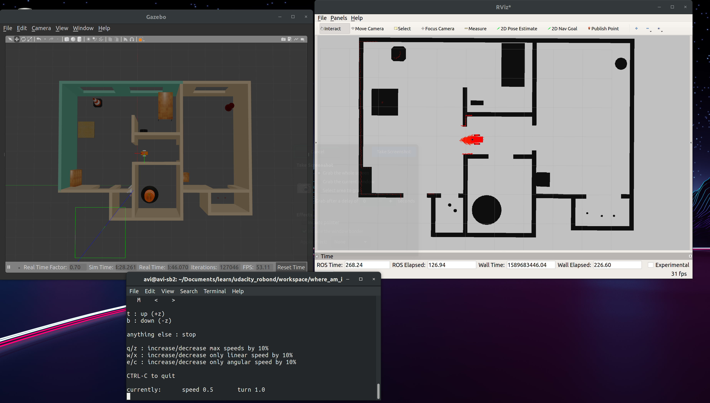
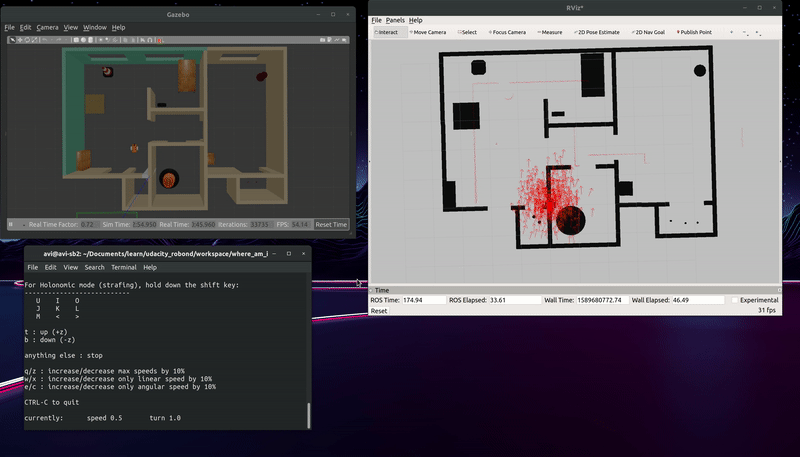
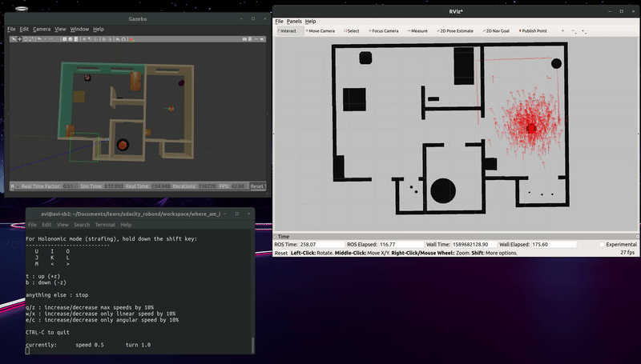

### AMCL in ROS - Udacity RoboND

####Folder Structure:
```bash
.
├── amcl_pkg
│   ├── CMakeLists.txt
│   ├── config
│   │   ├── base_local_planner_params.yaml
│   │   ├── costmap_common_params.yaml
│   │   ├── global_costmap_params.yaml
│   │   ├── local_costmap_params.yaml
│   │   └── __MACOSX
│   ├── include
│   │   └── amcl_pkg
│   ├── launch
│   │   └── amcl.launch
│   ├── maps
│   │   ├── apt_1br_map_mod.pgm
│   │   ├── apt_1br_map_mod.yaml
│   │   ├── apt_1br_map.pgm
│   │   ├── apt_1br_map.yaml
│   │   ├── apt_map.pgm
│   │   ├── apt_map.yaml
│   │   ├── udacity_mtv_map.pgm
│   │   └── udacity_mtv_map.yaml
│   ├── package.xml
│   └── src
├── CMakeLists.txt -> /opt/ros/melodic/share/catkin/cmake/toplevel.cmake
├── localized_robot_screenshot.png
├── my_robot
│   ├── CMakeLists.txt
│   ├── launch
│   │   ├── robot_description.launch
│   │   └── world.launch
│   ├── meshes
│   │   └── hokuyo.dae
│   ├── package.xml
│   ├── urdf
│   │   ├── my_robot.gazebo
│   │   └── my_robot.xacro
│   └── worlds
│       ├── robots_in_apt.world
│       └── udacity_mtv.world
├── README.md
├── teleop_twist_keyboard
│   ├── CHANGELOG.rst
│   ├── CMakeLists.txt
│   ├── package.xml
│   ├── README.md
│   └── teleop_twist_keyboard.py
├── tuned_amcl_1.gif
└── tuned_amcl_2.gif
```

#### Images


1. Localized robot starting from initial pose x:0, y:0. Move input provided by teleop_twist_keyboard.py


2. Localized robot after providing it a 2D pose estimate. Move input provided by teleop_twist_keyboard.py


