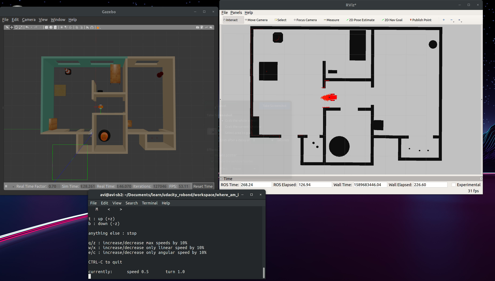
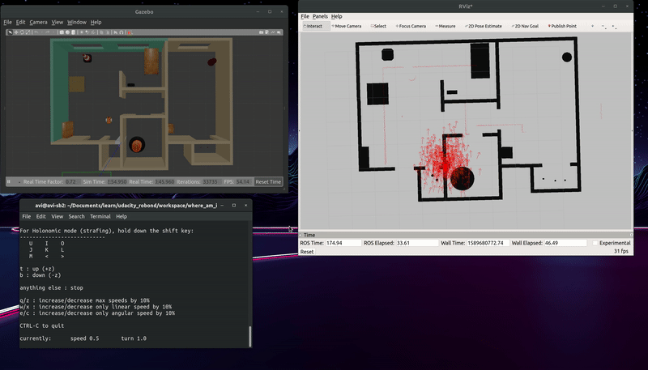
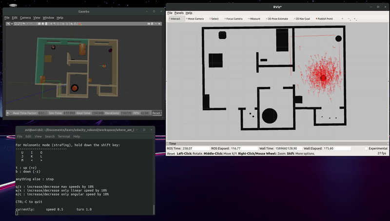

AMCL in ROS - Udacity RoboND

1. Localized robot starting from initial pose x:0, y:0. Move input provided by teleop_twist_keyboard.py

2. Localized robot after providing it a 2D pose estimate. Move input provided by teleop_twist_keyboard.py

